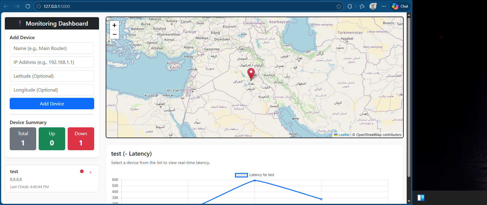
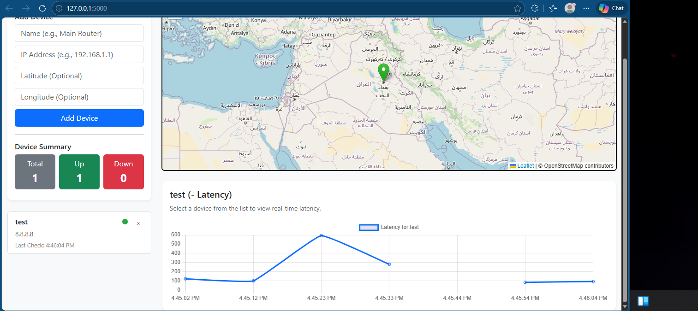

# Network Troubleshooting & Fault Detection System

<p align="center">
  
  
  
  
</p>

A complete smart system that monitors a local network, detects faults and performance issues, stores data locally, and visualizes devices on an interactive map.

## 📸 Screenshots

<p align="center">
  
  <br>
  <em>Monitoring Dashboard with Map and Device list</em>
  <br><br>
  
  <br>
  <em>Live latency charts and active map markers</em>
</p>

## 🌟 Core Features

- **Continuous Monitoring:** Monitors network devices using ICMP Ping to check availability, latency, and packet loss.
- **Fault Detection:** Automatically detects Device Down, High Latency, and Packet loss.
- **Local Database:** Uses a local SQLite database with SQLAlchemy ORM to log all events (Timestamp, IP, Status, Response Time).
- **Interactive Map:** Integrates Leaflet.js to display devices on a map with colored markers (Green = Online, Red = Offline, Orange = Warning).
- **Live Dashboard:** Real-time latency graphs using Chart.js and WebSockets (Flask-SocketIO) for live updates without refreshing the page.

## ⚙️ Tech Stack

- **Backend:** Python, Flask, Flask-SQLAlchemy, Flask-SocketIO
- **Frontend:** HTML, CSS, JavaScript, Bootstrap 5
- **Map Visualization:** Leaflet.js
- **Charts:** Chart.js
- **Database:** SQLite

## 🚀 Setup Instructions

### 1. Prerequisites
- Python 3.8+ installed on your system.
- Basic knowledge of using the terminal or command prompt.

### 2. Installation
Clone this repository or download the source code, then navigate to the project directory:

```bash
cd app
```

Create a virtual environment (optional but recommended):
```bash
python -m venv .venv
# On Windows:
.venv\Scripts\activate
# On Mac/Linux:
source .venv/bin/activate
```

Install the required dependencies:
```bash
pip install -r requirements.txt
```

### 3. Running the System
Start the Flask application. The system will automatically create the database `network_monitor.db` and start the background monitoring thread.

```bash
python app.py
```

### 4. Usage
Open your web browser and go to:
👉 **http://localhost:5000**

- Use the sidebar to add new devices by providing their Name, IP Address, and optional Latitude/Longitude.
- The map will populate with interactive markers.
- Click on any device in the list to reveal its live latency chart.

## 📂 Project Structure

```
app/
│
├── static/
│   ├── main.js        # Frontend logic (WebSockets, Map, Chart)
│   └── styles.css     # Custom UI styling
│
├── templates/
│   └── index.html     # Main dashboard interface
│
├── app.py             # Flask application entry point & routes
├── config.py          # Application configuration
├── models.py          # Database schema models
├── monitor.py         # Background ping monitoring thread
├── requirements.txt   # Python dependencies
└── README.md          # Project documentation
```

## 📝 License
This project is licensed under the GPL-3.0 License. See the [LICENSE](LICENSE) file for details.
